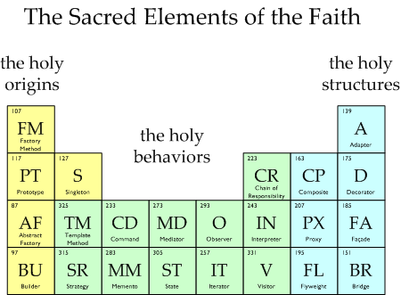

Design Patterns Study Group
===========================

.. contents:: Table of Contents
  :local:

The Books
---------

The readings used by this study group are a careful selection of different chapter from the following books:

* `Design Patterns Elements of Reusable Object-Oriented Software`_
* `Head First Design Patterns`_
* `Design Patterns Explained`_
* `Holub on Patterns`_
* `Refactoring to Pattern`_
* `Elemental Design Patterns`_
* `Object-Oriented Analysis and Design with Applications`_
* `Code Complete`_
* `Effective Java`_

Official Pattern Catalog
------------------------

Initially the group will cover the basic GoF design patterns. However there is no reason why the group cannot later work on other pattern catalogs from other domains (e.g. `JEE <https://www.amazon.com/Professional-Java-EE-Design-Patterns/dp/111884341X/ref=sr_1_1?s=books&ie=UTF8&qid=1422162198&sr=1-1&keywords=Java+EE+PAtterns>`_, `Enterprise Applications <https://www.amazon.com/Patterns-Enterprise-Application-Architecture-Martin/dp/0321127420/ref=sr_1_1?s=books&ie=UTF8&qid=1422162238&sr=1-1&keywords=patterns+of+enterprise+application+architecture>`_, `SOA <https://www.amazon.com/Design-Patterns-Prentice-Service-Oriented-Computing/dp/0136135161/ref=sr_1_2?s=books&ie=UTF8&qid=1422162269&sr=1-2&keywords=soa+patterns>`_, `Integration <https://www.amazon.com/Enterprise-Integration-Patterns-Designing-Deploying/dp/0321200683/ref=sr_1_1?s=books&ie=UTF8&qid=1422162295&sr=1-1&keywords=enterprise+integration+patterns>`_, `Functional <https://www.amazon.com/Functional-Programming-Patterns-Scala-Clojure/dp/1937785475/ref=sr_1_1?s=books&ie=UTF8&qid=1422162317&sr=1-1&keywords=Functional+Programming+patterns>`_, `Service <https://www.amazon.com/Service-Design-Patterns-Fundamental-Solutions/dp/032154420X/ref=sr_1_1?s=books&ie=UTF8&qid=1515981953&sr=1-1&keywords=Service+Design+Patterns>`_, etc.)

Study Group Mechanics
---------------------

The study group members gather regularly to improve their understanding of design patterns. The study group organizes and maintains an agenda of readings. Prior to each meeting, participants have read and reflected upon the readings and must come prepared with questions, ideas about, or explanations of the readings. 

One individual, the moderator, asks the opening question at the commencement of each meeting. This individual is charged with guiding the dialogue during the rest of the meeting, but this individual is not a teacher. He or she is simply considered to be the most advanced student with respect to a reading. If an individual is more advanced than others in the group, it makes sense for that individual to perform the role of moderator for serval meetings until others feel confortable in that role. Should a debate get out of hand or a dialogue stray or lag, the moderator will help refocus the discussion, often asking if the opening questions has been answered or stepping in to make sure that statements are properly validated.  

Individuals meet around a table or in a circle for 1 or 2 hours, and group size varies from 3 to as many as 10 individuals

Study Group vs. Lectures
^^^^^^^^^^^^^^^^^^^^^^^^

It is important to note the difference between study groups and lectures. While there is nothing wrong with lectures, they have a tendency to create a passive learning experience for attendees. If one is interested in simply gathering information, a lecture may be a fine place to do it. But if one really wants to understand something (to "get your hands dirty"), there is nothing like a study group. While attendees of a lecture may seek information, attendees in a study group seek transformation; they want to make what they study not only something they understand, but something they may use in their everyday lives or work. The study group thus acts as a bridge, helping people move from passive to active learning.

While "experts" are often asked to give lectures, study groups prefer to invite experts to participate in a group, to ask opening questions and be an active member in a dialogue. The focus here is always on great literature, be it an important paper, article, or book. The group's dialogue revolves around getting to a better understanding of the issues.

Membership Rules
^^^^^^^^^^^^^^^^
The members of the study group must follow the next three simple rules:

* Do the readings!
* Come prepared or don't come at all!
* Participate. Bring questions, answers, explanations, ideas!

The second rule may sound harsh, but that's what guarantees the dynamics of the study group. Otherwise the group quickly transforms into a lecture hall where the more advanced student becomes the lecturer.

Tips and Suggestions for Members
^^^^^^^^^^^^^^^^^^^^^^^^^^^^^^^^

If you really want to take advantage of your group membership, you must do the readings before the group meetings and reflect on their contents. Without an effort to understand the complex materials covered in the readings there will be very little to discuss during the group sessions and the learning transformation exercise all other members of the group are expecting gets seriously handicapped.  

Don't wait to a few hours before the session to start doing the readings, the concepts covered in them are not easy to digest and requires time and reflection to fully grasp them. Therefore, separate time for this purpose in such a way that you can thoroughly cover the material before the day of the meeting. 

Since the group sessions are not lessons, but moderated discussions, it is of paramount importance that you come prepared to discuss the material. Passive members that don't do the work but come to the meetings to see what they can learn won't be tolerated in this type of group as they would be disastrous to the group dynamics. Additionally, this behavior would not be respectful for the rest of group members who thoroughly prepared themselves to discuss their ideas during the group session. 

Remember, you do the readings in your own time, and come to the sessions to learn, discuss the material, ask questions, give explanations or simply deepen your knowledge and understanding. The group is just a driving and guiding force to help you achieve the goal of becoming better at understanding using a set of design patterns.

A good way to prepare for a sessions is to print the readings, and then highlight points you would like to bring to discussion during the next sessions (e.g.  those concepts that  you did not fully understand or those ideas that you found particularly insightful). You may write side notes with questions, reflections, explanations or ideas. Another great way to contribute is to bring your own examples of where the pattern has been used appropriately or pieces of code or examples of problems that could be solved with a given pattern.

Also take a look at the preliminary list of  questions suggested in this site for every pattern and try to see if you can answer them after doing the readings. Most importantly, during the sessions, engage in conversations and discussions since this is the most enriching of all group activities. 

GoF Patterns Study Guide
------------------------

TBD

Further Readings
----------------

A selection of web sites where members of the group can continue their learning journey.

Design Patterns Catalogs
^^^^^^^^^^^^^^^^^^^^^^^^

`SourceMaking`_:
 Website specialized in design patterns, anti-patterns, refactoring and UML.

`Catalog of Patterns of Enterprise Application Architecture`_:
 Martin Fowler awesome catalog of enterprise application patterns.

`Enterprise Integration Patterns`_:
 Great catalog of patterns to create messaged-based systems.

`Workflow Patterns`_:
 A catalog of workflow orchestration patterns.

Object-Oriented Programming 101: Must Reads
^^^^^^^^^^^^^^^^^^^^^^^^^^^^^^^^^^^^^^^^^^^

`Principles of Object Oriented Design`_:
 Website containing dozens of references to other excellent papers on well known design techniques, principles and patterns.

`Type, Data Abstraction and Polymorphism`_:
 Best explanation ever on polymorphism and type systems by the great type theorist Luca Cardeli.

`Encapsulation and Inheritance`_:
 Best explanation ever on the true meaning of encapsulation by the great Alan Snyder.

`Abstraction vs Information Hiding vs Encapsulation`_:
 Great article that delves into the semantic similarities and differences of these three fundamental concepts.

 `Design by Contract`_:
 A coherent set of methodological principles helping to produce correct and robust software.

Other Interesting Readings
^^^^^^^^^^^^^^^^^^^^^^^^^^

`Teach Yourself Programming in Ten Years`_:
 Peter Norving with a compelling argument about how it takes time and effort to become really good at programming.

`Non-software Examples of Design Patterns`_:
 Interesting examples of design patterns used in ordinary, real life situations.

.. _Design Patterns Elements of Reusable Object-Oriented Software: http://www.informit.com/store/design-patterns-elements-of-reusable-object-oriented-9780201633610
.. _Head First Design Patterns: https://www.amazon.com/Head-First-Design-Patterns-Brain-Friendly-ebook/dp/B00AA36RZY
.. _Design Patterns Explained: http://www.informit.com/store/design-patterns-explained-a-new-perspective-on-object-9780321247148
.. _Holub on Patterns: https://www.apress.com/la/book/9781590593882#otherversion=9781430253617
.. _Refactoring to Pattern: http://www.informit.com/store/refactoring-to-patterns-9780321213358
.. _Object-Oriented Analysis and Design with Applications: http://www.informit.com/store/object-oriented-analysis-and-design-with-applications-9780201895513
.. _Elemental Design Patterns: http://www.informit.com/store/elemental-design-patterns-9780321711922
.. _Code Complete: http://www.informit.com/store/code-complete-9780735619678
.. _Effective Java: http://www.informit.com/store/effective-java-9780134685991
.. _Refactoring Improving the Design of Existing Code: http://www.informit.com/store/refactoring-improving-the-design-of-existing-code-9780201485677
.. _SourceMaking: https://sourcemaking.com
.. _Catalog of Patterns of Enterprise Application Architecture: https://martinfowler.com/eaaCatalog/
.. _Enterprise Integration Patterns: http://www.enterpriseintegrationpatterns.com/patterns/messaging/
.. _Workflow Patterns: http://workflowpatterns.com
.. _Principles of Object Oriented Design: http://www.butunclebob.com/ArticleS.UncleBob.PrinciplesOfOod
.. _Type, Data Abstraction and Polymorphism: https://drive.google.com/file/d/0Bxed3Yafe-7xRkJMOGR3UGdIZG8/view
.. _Encapsulation and Inheritance: https://drive.google.com/file/d/0Bxed3Yafe-7xeWFqeEZXNHljM1U/view
.. _Abstraction vs Information Hiding vs Encapsulation: http://www.tonymarston.co.uk/php-mysql/abstraction.txt
.. _Teach Yourself Programming in Ten Years: https://drive.google.com/file/d/0Bxed3Yafe-7xQ05oNDVBX0ZTQms/view
.. _Non-software Examples of Design Patterns: http://citeseerx.ist.psu.edu/viewdoc/download?doi=10.1.1.106.8473&rep=rep1&type=pdf
.. _A Study of The Fragile Base Class Problem: http://www.cas.mcmaster.ca/~emil/Publications_files/MikhajlovSekerinski98FragileBaseClassProblem.pdf
.. _Design by Contract: http://se.inf.ethz.ch/~meyer/publications/computer/contract.pdf
